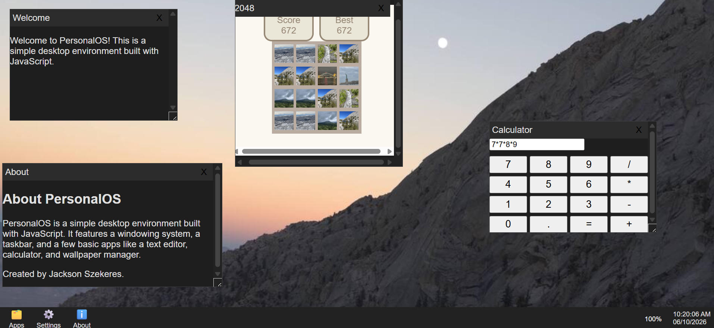

# Personal OS
## An emulation of a operating system in a web browser

### [Try It](https://personal-os-silk-six.vercel.app)

# Features:
- A fully functioning window system
- App launcher
- Taskbar
- Dark mode
- Custom wallpapers

# How it works:
The window system stores the `id`, `title`, `content`, `width`, `height`, `x`, `y`, and referenced element of each window. The app launcher stores the `name`, `content`, `icon`, `onload`, and window properties of each app, which is passed to the window system when the app is loaded from the taskbar or app launcher.